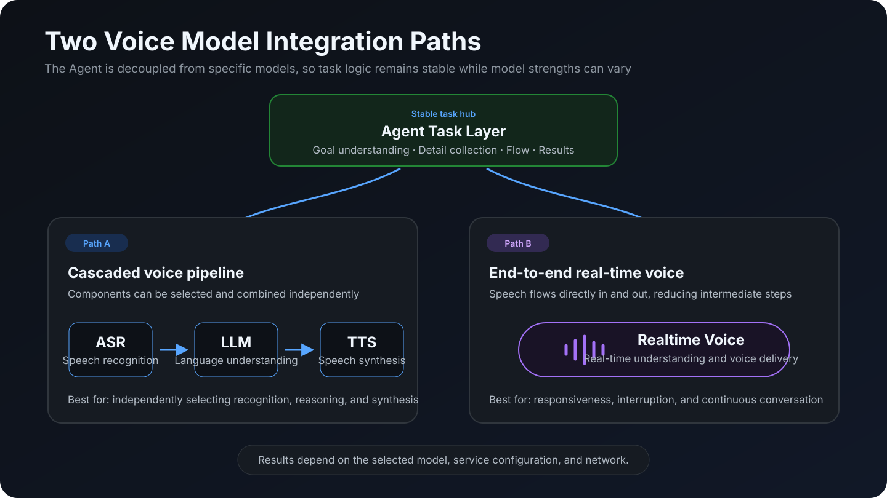
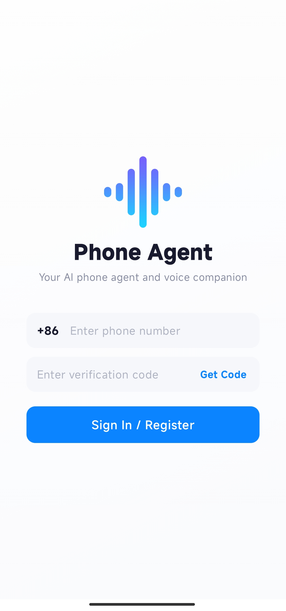
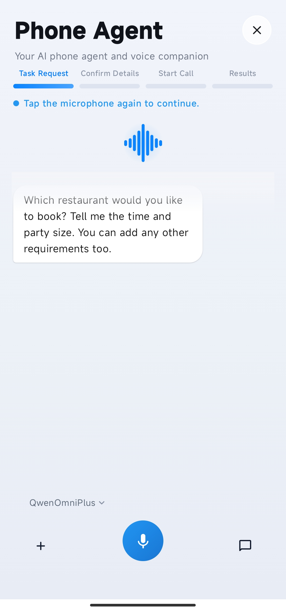
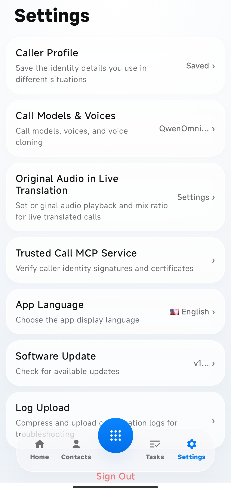
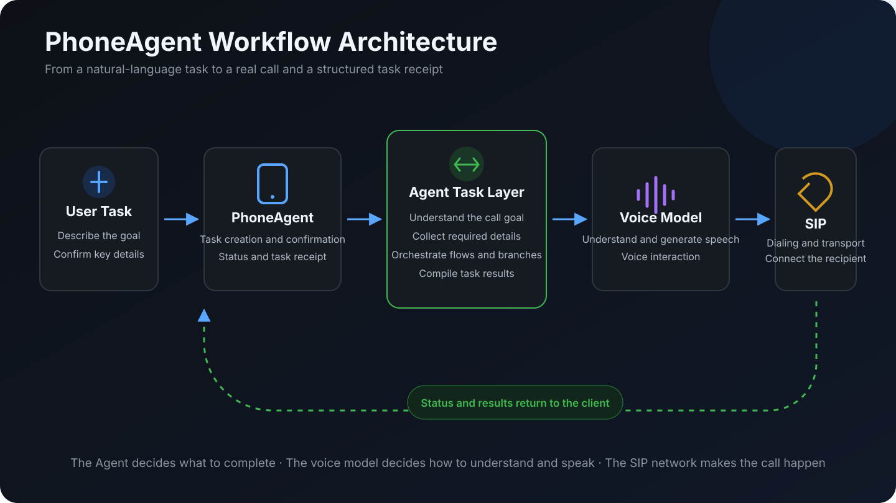
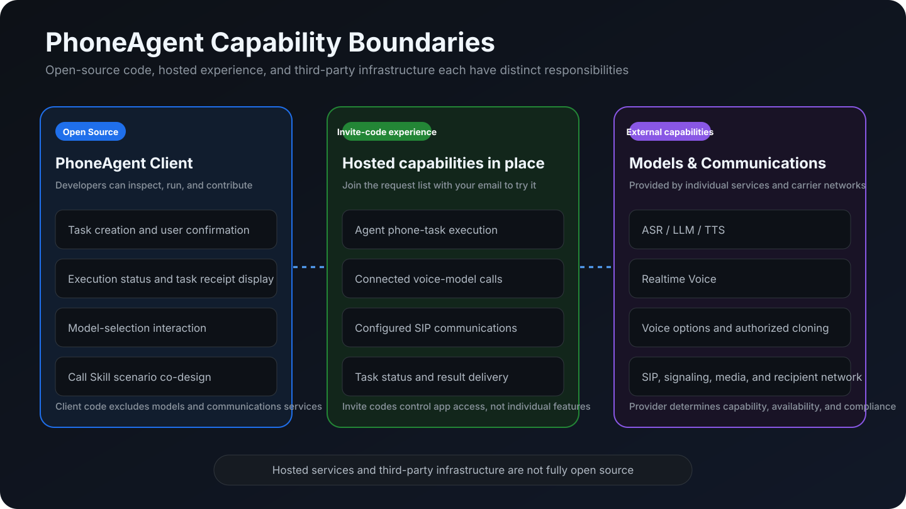
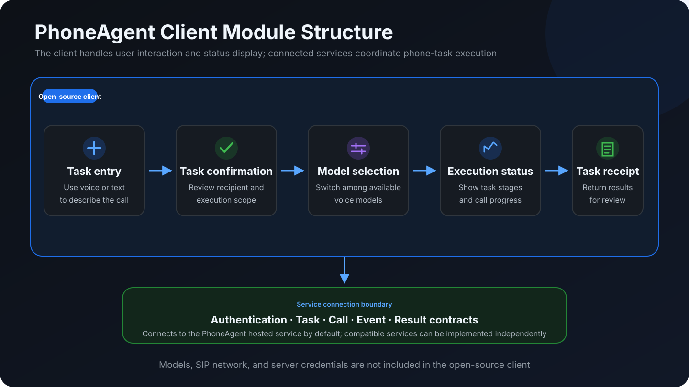

# PhoneAgent · Your AI Phone Agent and Voice Companion

**An open-source intelligent Agent built for real phone tasks.**

Describe a reservation, notification, coordination task, or cross-language call by voice or text. PhoneAgent helps fill in the essential details, runs a supported call flow after you confirm, and returns the call status, transcript, and task result to your device.

[Download APK](https://github.com/vvtech-ai/PhoneAgent/releases/download/v1.0.36/PhoneAgent-1.0.36.apk) · [View Source](https://github.com/vvtech-ai/PhoneAgent) · [Build Locally](#quick-start) · [Request an Invite Code](https://chaken.ai)

> The PhoneAgent client source is public and open for inspection, local builds, and community contributions. The app is currently in a controlled testing phase and requires an invite code for activation.


## Complete a Phone Task with AI

```text
Speak or type your request
  → Fill in the time, location, contact, and other details
  → Confirm who to call and what the task should cover
  → Run a supported call flow
  → Review the status, transcript, and task result
```

PhoneAgent is designed for real phone tasks:

- Unlike a general chat assistant, it takes a request through confirmation, calling, and result delivery.
- Unlike a general-purpose Agent product, it focuses on AI phone tasks and real-time translation.

## Core Capabilities

- **Create tasks by voice or text**: Describe the phone task you want to complete.
- **Fill in essential details**: Organize the time, location, contact, phone number, party size, and preferences.
- **Confirm before execution**: Review the recipient, key details, and execution scope before dialing.
- **Agent call workflow**: Understand the goal, collect missing information, request confirmation, and work with the hosted service to complete supported phone tasks.
- **Switch voice models**: Select from the models currently available through the hosted service based on the task. Different models may offer different real-time response, interruption handling, continuous conversation, cross-language communication, and voice-expression capabilities.
- **Real-time translation**: Show both sides' transcripts and translations where supported by the selected model and region.
- **Contact assistance**: Read contacts with permission, or accept a phone number entered manually.
- **Review results**: View task status, call history, transcripts, and task results.



## Common Use Cases

| Use Case | How PhoneAgent Helps | Current Status |
| --- | --- | --- |
| Restaurant reservations | Collects the time, party size, location, and preferences, then enters the call flow after confirmation | Built-in entry point |
| Meeting invitations | Organizes contacts and the message, then collects call results | Built-in entry point |
| Real-time translation | Starts a translated call and shows both sides' transcripts and translations | Supported |
| General phone tasks | Accepts a task by voice or text, fills in missing information, and executes after confirmation | Not available in the app |
| Community Call Skills | Designs reusable flows for reservations, support, logistics, and other scenarios | Planned; SDK not released |

Availability depends on the account, model, communications network, region, and hosted-service status.

### Agent, Voice Model, and Communications Network Responsibilities

PhoneAgent separates task decisions, voice interaction, and phone connectivity. The Agent decides what to do and when the task is complete. The voice model handles understanding and expression during the call. SIP and the communications network establish the actual phone connection. Users can switch among voice models currently offered by the hosted service; changes take effect on the next call.

| Agent | Voice Model | SIP / Communications Network |
| --- | --- | --- |
| Understands the task the user wants to complete | Handles speech understanding and generation during the call | Establishes and carries the real phone connection |
| Collects required details such as time and location | Shapes real-time response, interruption handling, and voice delivery | Handles signaling routes and media transport |
| Requests confirmation from the user | Supports real-time conversation or translation | Connects the recipient's phone number to the carrier network |
| Orchestrates the call flow and handles exceptions | Provides voice output and voice options; voice cloning is available only through authorized services | Returns call events such as connection and hangup |
| Summarizes status, transcripts, and the task receipt | Follows the task goal and call requirements defined by the Agent | Does not interpret the task or decide whether it is complete |

## Product Experience

<table>
  <tr>
    <td align="center"><strong>Sign In</strong><br></td>
    <td align="center"><strong>Home</strong><br></td>
  </tr>
  <tr>
    <td align="center"><strong>Create a Task by Text</strong><br></td>
    <td align="center"><strong>Create a Task by Voice</strong><br></td>
  </tr>
  <tr>
    <td align="center"><strong>AI Call and Live Translation</strong><br></td>
    <td align="center"><strong>Task History</strong><br></td>
  </tr>
  <tr>
    <td align="center"><strong>Settings</strong><br></td>
    <td align="center"><strong>Switch Voice Models</strong><br></td>
  </tr>
</table>

[View the Full Product Tour](docs/PROJECT_INTRODUCTION.md)

## Download and Install

[**Download the signed PhoneAgent v1.0.36 APK**](https://github.com/vvtech-ai/PhoneAgent/releases/download/v1.0.36/PhoneAgent-1.0.36.apk) · [View the Latest Release](https://github.com/vvtech-ai/PhoneAgent/releases/latest)

- Package: `com.vvtech.aiassistant`
- Version: `1.0.36` (`versionCode 30`)
- Requires Android 8.0 (API 26) or later on an `arm64-v8a` device.
- Connects to the PhoneAgent hosted open-source service by default. An [invite code](https://chaken.ai) is required for first-time activation.
- UI languages: English and Simplified Chinese.
- File SHA-256: `38da610a814ab331fa5bfa29bba33a6eeec5f365a6f9d1017dfe8f225aa3f5ec`.
- Signing certificate SHA-256: `017bb27a94baf1549ce7021363e2efc0bf86d93e6a48834c7489288966af2a4b`.

After downloading, allow your browser or file manager to install unknown apps, then open the APK. Android cannot update an installed app with an APK signed by a different certificate. If that happens, back up any required data before uninstalling the old build; uninstalling removes its local data.

## Quick Start

### Requirements

- JDK 11
- Android Studio or Android SDK command-line tools
- Android SDK 33
- A physical device running Android 8.0 (API 26) or later

### Build the Debug APK

Windows:

```powershell
Copy-Item local.properties.example local.properties
.\gradlew.bat :app:assembleProdDebug
```

macOS / Linux:

```bash
cp local.properties.example local.properties
./gradlew :app:assembleProdDebug
```

Set the Android SDK path in `local.properties` before building. The APK is generated in:

```text
app/build/outputs/apk/prod/debug/
```

See [Build and Configuration](docs/BUILD_AND_CONFIGURATION.md) for detailed setup instructions.

## Request an Invite Code

The app currently requires an invite code for activation. An invite code provides access to the voice models, SIP communications, and PhoneAgent call workflows already connected to the hosted service. Visit the PhoneAgent website and enter your email address to join the request list:

[Enter Your Email to Request an Invite Code](https://chaken.ai)

Invite codes are sent in batches based on service capacity. Watch your inbox for updates.

> Official invite codes are not sold. Do not purchase one from a third party.

## Help Validate Real Phone Use Cases

Beyond invite-code requests, PhoneAgent use-case submissions, events, discussions, and project results take place in the open-source community.

### Submit a Call Skill Design

PhoneAgent aims to organize reservations, notifications, support, logistics, cross-language communication, and similar use cases into reusable Call Skills. Turn the phone call you most want AI to handle into a Call Skill design and share it with the open-source community. Selected proposals may receive a PhoneAgent invite code.

A Call Skill is intended to describe:

- Which user requests it matches
- Which information it must collect and confirm
- Which strategy the call should follow
- Which tools it may use
- How it handles rejection, no answer, and exceptions
- How it determines whether the task is complete
- Which structured result it returns
- Which permissions and safety constraints it requires

A useful submission should cover the use case and target users, required inputs, user confirmation points, call strategy, rejection and no-answer handling, completion criteria, result format, permission and compliance risks, and test cases.

> **The Call Skill SDK, runtime, and distribution platform have not been released.** This program currently accepts use-case design proposals, not executable Skill packages.

[Open a GitHub Issue](https://github.com/vvtech-ai/PhoneAgent/issues/new) · [Read the Call Skill Vision](docs/CALL_SKILLS.md) · [View the Roadmap](docs/ROADMAP.md)

## Technical Architecture

PhoneAgent connects client interactions, Agent call workflows, voice models, and the communications network into an end-to-end execution path:



## Open-Source Scope

| Included in This Repository | Not Included in This Repository |
| --- | --- |
| Kotlin / Jetpack Compose Android client source | Backend source, admin console, and database schema |
| Client-side task, networking, voice, SIP, WebRTC, and UI logic | Backend deployment scripts, production configuration, and production data |
| Android test samples and project documentation | Server-side credentials for model, SMS, SIP, mapping, and other services |
| The CHAKEN trusted-communications SDK components authorized for public redistribution | Commercial SDKs not authorized for public redistribution |
| The Call Skill vision and community proposal entry point | The Call Skill SDK, runtime, and distribution platform |

The client connects to the PhoneAgent hosted service by default. Developers may connect a compatible service they implement themselves, but must independently implement the authentication, task, calling, event, and record contracts used by the client.





[Understand the Backend Service Boundary](docs/BACKEND_SERVICE.md) · [View the Full Architecture](docs/ARCHITECTURE.html)

## Responsible Use and Contributing

Real outbound calls, recordings, and translations must comply with applicable laws, carrier rules, and service terms. Do not submit real phone numbers, verification codes, tokens, recordings, transcripts, or identity documents in Issues, logs, or test materials. Do not use PhoneAgent for harassment, spam marketing, deception, or unauthorized identity simulation.

Contributions to the Android client, bug fixes, tests, documentation, and Call Skill use-case proposals are welcome. Before you begin, read the [Contributing Guide](CONTRIBUTING.md) and review [Good First Issues](https://github.com/vvtech-ai/PhoneAgent/labels/good%20first%20issue).

[Privacy and Permissions](docs/PRIVACY_AND_PERMISSIONS.md) · [Security Policy](SECURITY.md) · [Known Issues](docs/KNOWN_ISSUES.md)

## License

Client source provided by the copyright holder in this repository is licensed under the [Apache License 2.0](LICENSE). Third-party components, the hosted service, and optional commercial SDKs remain subject to their respective licenses and terms of service. See [THIRD_PARTY_NOTICES.md](THIRD_PARTY_NOTICES.md) for details.
