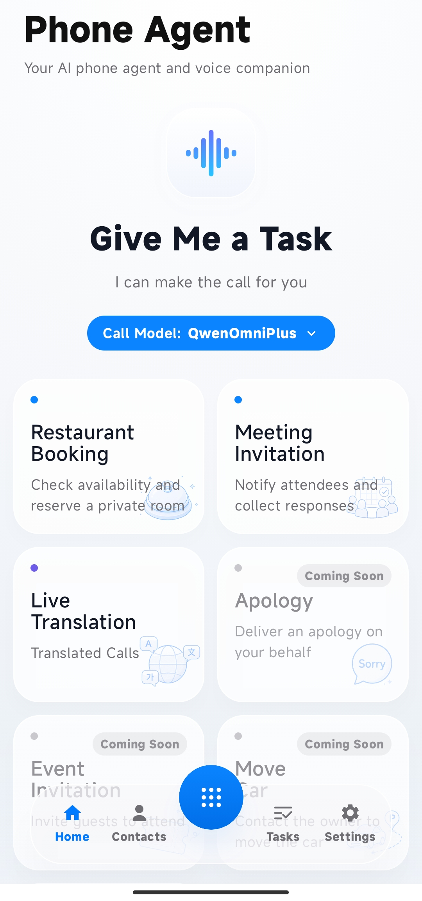
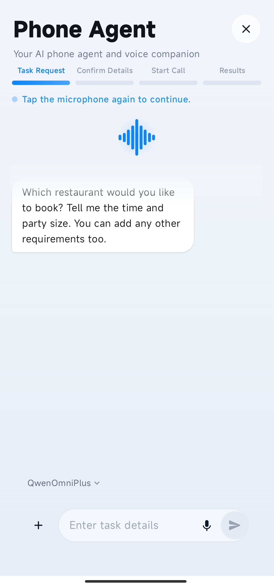
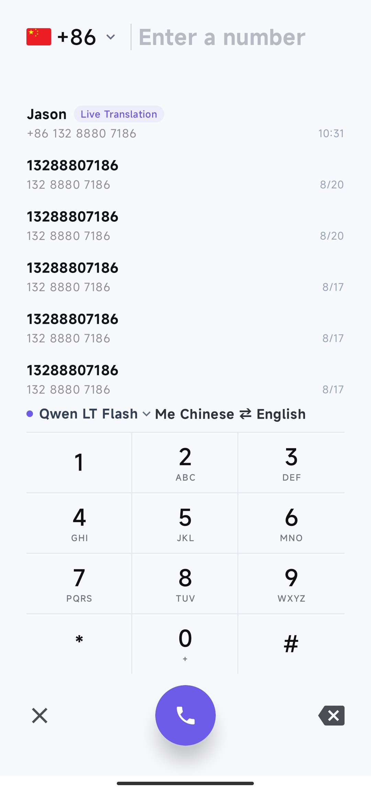
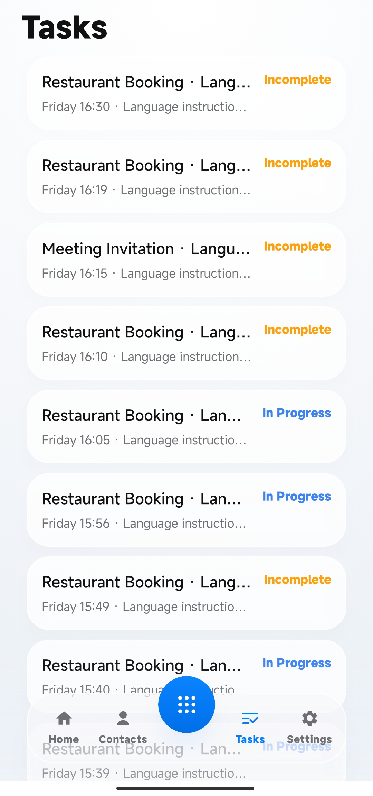
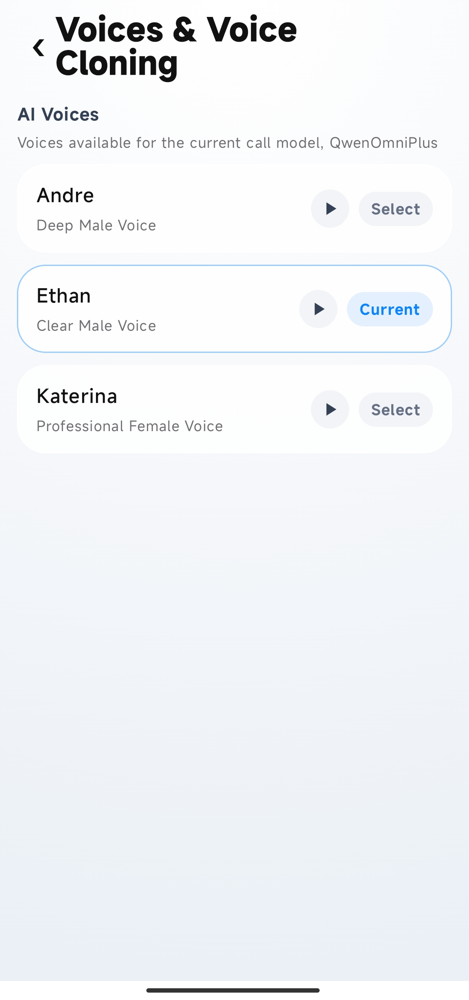
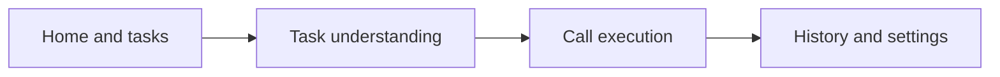

# PhoneAgent · AI Calling Agent, Your Voice Delegate

**An open-source intelligent Agent built for real phone tasks.**

Describe an appointment, notification, coordination task, or cross-language conversation by voice or text. PhoneAgent helps complete the key details, executes a supported calling workflow after your confirmation, and returns call status, transcripts, and task results to the client.

[Download APK](https://github.com/vvtech-ai/PhoneAgent/releases/download/v1.0.36/PhoneAgent-1.0.36.apk) · [View source](.) · [Quick start](#quick-start) · [Request an invite code](https://chaken.ai)

> The PhoneAgent client source is public and open for inspection, building, and contribution. The app is currently in controlled testing and requires an invite code for activation.



## Complete a phone task with AI

```text
Speak or type a request
  → complete the time, location, contacts, and other details
  → confirm the callee and task content
  → execute a supported calling workflow
  → review status, transcripts, and task results
```

PhoneAgent focuses on real telephone workflows:

- unlike a general chat assistant, it moves a request through confirmation, calling, and result delivery;
- unlike a general-purpose Agent product, it specializes in AI phone tasks and real-time translation.

## Core capabilities

- **Create tasks by voice or text**: describe the phone task you want to complete.
- **Complete key details**: organize time, location, contacts, numbers, party size, and preferences.
- **Confirm before execution**: review the callee, key content, and execution scope before dialing.
- **Agent calling workflow**: understand the goal, collect missing details, request confirmation, and coordinate supported phone tasks with the hosted service.
- **English and Simplified Chinese UI**: switch the app display language from Settings without changing the language used for a call task.
- **Switchable voice models**: select from voice models currently enabled by the hosted service to fit different real-time conversation, expression, and cross-language scenarios.
- **Real-time translation**: display transcripts and translated text for both parties where supported by the model and region.
- **Contact assistance**: read contacts after permission is granted or accept a manually entered number.
- **Reviewable results**: inspect task state, call history, transcripts, and task results.

## Typical scenarios

| Scenario | How PhoneAgent helps | Current status |
| --- | --- | --- |
| Restaurant reservations | Organizes time, party size, location, and preferences before entering the calling workflow | Built-in entry |
| Meeting invitations | Organizes contacts and notification content, then collects call outcomes | Built-in entry |
| Real-time translation | Starts a translated call and displays both transcripts and translations | Supported |
| General phone tasks | Describes a task by voice or text, completes details, and executes it | Not exposed in the app |
| Community Call Skills | Designs reusable workflows for appointments, support, logistics, and more | Planned; SDK not released |

Actual availability depends on the account, model, telephony route, region, and hosted-service status.

### Agent and voice-model responsibilities

PhoneAgent separates phone-task intelligence from the voice model. The Agent understands and completes the task; the voice model handles real-time speech understanding and expression during the call. Users can choose among models currently enabled by the hosted service. A model change takes effect on the next call.

| Agent | Voice model |
| --- | --- |
| Understands the task the user wants to complete | Handles speech understanding and generation during the call |
| Collects required details such as time and location | Affects interaction, responsiveness, and expression |
| Requests task confirmation from the user | Supports real-time conversation or translation |
| Orchestrates the calling workflow and handles exceptions | Provides voices and voice-cloning capabilities |
| Summarizes status, transcripts, and task receipts | Executes the task goal and call requirements set by the Agent |

## Product experience

| Create a task | AI call |
| --- | --- |
|  |  |

| Task receipt | Switchable voice models |
| --- | --- |
|  |  |

[View the complete product tour](docs/PROJECT_INTRODUCTION.md)

## Download and install

[**Download the signed PhoneAgent v1.0.36 APK**](https://github.com/vvtech-ai/PhoneAgent/releases/download/v1.0.36/PhoneAgent-1.0.36.apk) · [View the latest release](https://github.com/vvtech-ai/PhoneAgent/releases/latest)

- Requires Android 8.0 (API 26) or later on an `arm64-v8a` device.
- Connects to the PhoneAgent hosted open-source service by default. An [invite code](https://chaken.ai) is required for first-time activation.
- UI languages: English and Simplified Chinese.
- File SHA-256: `38da610a814ab331fa5bfa29bba33a6eeec5f365a6f9d1017dfe8f225aa3f5ec`.
- Signing certificate SHA-256: `017bb27a94baf1549ce7021363e2efc0bf86d93e6a48834c7489288966af2a4b`.

After downloading, allow your browser or file manager to install unknown apps, then open the APK. Android cannot update an installed app with an APK signed by a different certificate. If that happens, back up any required data before uninstalling the old build; uninstalling removes its local data.

## Quick start

### Requirements

- JDK 11
- Android Studio or Android SDK command-line tools
- Android SDK 33
- A physical device running Android 8.0 (API 26) or later

### Build a debug APK

Windows:

```powershell
Copy-Item local.properties.example local.properties
.\gradlew.bat :app:assembleProdDebug
```

macOS / Linux:

```bash
cp local.properties.example local.properties
./gradlew :app:assembleProdDebug
```

Set the Android SDK path in `local.properties` first. The APK is generated under:

```text
app/build/outputs/apk/prod/debug/
```

See [Build and configuration](docs/BUILD_AND_CONFIGURATION.md) for details.

## Request an invite code

The app currently requires an invite code for activation. An invite code provides access to the connected voice models, SIP communication, and PhoneAgent calling workflows. Visit the PhoneAgent website and submit your email address to join the request list:

[Submit your email and request an invite code](https://chaken.ai)

Invite codes are sent in batches according to service capacity. Watch the inbox of the email address you submit.

> Official invite codes are not sold. Do not purchase one from a third party.

## Help validate real phone scenarios

Apart from invite-code requests, PhoneAgent scenario proposals, activities, discussions, and results belong in the open-source community.

### Scenario call: submit a Call Skill design

PhoneAgent aims to organize appointments, notifications, support, logistics, and cross-language communication as reusable Call Skills. Turn the call you most want AI to handle into a Call Skill design and submit it to the designated email address. Strong proposals may receive a PhoneAgent invite code.

A Call Skill is expected to describe:

- which user requests it matches;
- which information must be collected and confirmed;
- which strategy the call follows;
- which tools it may use;
- how it handles rejection, no answer, and exceptions;
- how it determines task completion;
- which structured result it returns;
- which permissions and safety constraints apply.

We recommend including the scenario and target users, required inputs, confirmation points, calling policy, rejection and no-answer handling, completion criteria, result format, permission and compliance risks, and test cases.

> **The Call Skill SDK, runtime, and distribution platform have not been released.** The current call is for scenario-design proposals, not executable Skill packages.

Submission email to be announced · [Call Skill vision](docs/CALL_SKILLS.md) · [Roadmap](docs/ROADMAP.md)

## Open-source scope

| Included in this repository | Not included |
| --- | --- |
| Kotlin and Jetpack Compose Android client source | Backend source, admin console, and database schema |
| Task, networking, voice, SIP, WebRTC, and UI logic | Backend deployment scripts, production configuration, and production data |
| Android test fixtures and project documentation | Server-side model, SMS, SIP, map, and other credentials |
| CHAKEN trusted-call SDK authorized for public redistribution | Commercial SDKs without public redistribution permission |
| Call Skill vision and community-proposal entry point | Call Skill SDK, runtime, and distribution platform |

The client connects to the PhoneAgent hosted service by default. Developers may connect an independently implemented compatible service, but must implement the authentication, task, calling, event, and history contracts used by the client.

[Hosted backend boundary](docs/BACKEND_SERVICE.md) · [Client and full-stack architecture](docs/ARCHITECTURE.html)



## Responsible use and contribution

Real outbound calls, recordings, and translation must comply with applicable laws, carrier rules, and service terms. Never submit real phone numbers, verification codes, tokens, recordings, transcripts, or identity materials in issues, logs, or test artifacts. PhoneAgent must not be used for harassment, spam calling, deception, or unauthorized impersonation.

Contributions are welcome for client improvements, bug fixes, tests, documentation, and Call Skill scenario proposals. Read the [contribution guide](CONTRIBUTING.md) first and watch for future Good First Issues.

[Privacy and permissions](docs/PRIVACY_AND_PERMISSIONS.md) · [Security policy](SECURITY.md) · [Known issues](docs/KNOWN_ISSUES.md)

## License

First-party client source in this repository is licensed under the [Apache License 2.0](LICENSE). Third-party components, hosted services, and optional commercial SDKs remain subject to their respective licenses and service terms. See [THIRD_PARTY_NOTICES.md](THIRD_PARTY_NOTICES.md).
