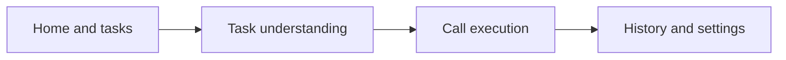

# Phone Agent Project Introduction

## Turn a request into a phone-call result

Phone Agent is an Android intelligent client for real phone tasks. Users do not need to learn a complex calling workflow first: they describe a need by voice or text, and the system helps organize key details, confirm the task, execute a supported call flow, and return status, transcripts, and results to the device.

The current client includes entries for restaurant reservations, meeting invitations, real-time translation, and general phone tasks. It is also evolving toward a **Call Skill** ecosystem in which developers can build reusable phone workflows for appointments, support, logistics, travel, and many other scenarios.

This repository opens the Android client source. Model inference, SMS authentication, map search, task orchestration, telephony, and data services run on a hosted backend whose source is not included.



## A complete user journey

### 1. Sign in and prepare the device

Users sign in or register with a phone number and SMS verification code. On first use, the client checks network, microphone, and speaker/headset readiness as required, then requests contacts, phone, location, or camera permissions only for features that need them.


### 2. Choose a scenario or describe the need

The home screen presents enabled phone scenarios and the selected call model. Users can enter restaurant, meeting-invitation, or translated-call flows, or describe a general phone task from the central entry point.


### 3. Complete the task by voice or text

Users can hold the voice button or switch to text input. The system collects required details such as time, location, contact, number, party size, or preferences, then asks for confirmation before execution.


### 4. Confirm and enter the call flow

The dialer confirms the callee number, call model, and real-time translation settings. The client and hosted backend coordinate supported tasks; model access, telephony capacity, regions, and concurrency depend on the hosted service.


### 5. Review the process and outcome

Completed tasks appear in history. Users can inspect time, number, state, transcript, task outcome, and recordings when access is authorized.


### 6. Configure identity, models, and voices

Settings manage identity information, AI call models and voices, trusted-call options, app updates, and log upload. Voice-clone identity verification can be integrated after separately licensing the required commercial service.


## Core capabilities

- **Natural-language task entry** through voice or text.
- **Detail collection and confirmation** for time, location, contacts, party size, and other task fields.
- **Real phone workflows** coordinated across the client, hosted models, business tools, and telephony.
- **Real-time translation presentation** with bidirectional transcripts and translated text where supported.
- **Contacts and number assistance** after explicit user authorization.
- **Persistent outcomes** including task state, history, transcripts, results, and authorized recordings.
- **Model and voice preferences** based on the catalog exposed by the hosted service.
- **Trusted communication and observability** through bundled integration and user-initiated log export or upload.

## From built-in scenarios to Call Skills

Phone Agent provides built-in scenarios today. The long-term goal is to expose their common structure to developers. A Call Skill will describe matching rules, input fields, dialogue policy, allowed tools, completion criteria, result format, permissions, and compliance requirements.

```text
User intent
  → match a Call Skill
  → collect and confirm required information
  → execute constrained call policy and tools
  → return a structured result
```

The Call Skill SDK has not been released. The project intends to publish the conceptual model and proposal process first, followed by specifications, SDKs, debugging and testing tools, and community distribution. See the [Call Skill vision](CALL_SKILLS.md) and [roadmap](ROADMAP.md).

## Technology overview

- Kotlin, Jetpack Compose, and AndroidX
- MVVM, unidirectional data flow, Kotlin Coroutines, and Flow
- Retrofit and OkHttp for HTTP and SSE
- WebSocket audio and real-time event transport
- SIP, WebRTC, audio capture, and playback
- Local caching, contacts, call log, and OTA integration
- First-party hardened CHAKEN trusted-call SDK

See [Full-stack architecture and open-source boundary](ARCHITECTURE.html) for the client, backend, SIP/PSTN, model-provider, and project-scope view.

## Open-source and service boundary

This repository is intended for understanding, building, and extending the Android client. It does not include:

- Java/Spring backend or admin-console source;
- production credentials for models, SMS, SIP, maps, or object storage;
- production databases, operations scripts, deployment topology, or internal engineering records;
- commercial AAR/JAR files without public redistribution permission;
- the planned Call Skill SDK or distribution platform.

The client connects to the Phone Agent hosted service by default. Developers may customize the UI and client policies, or independently implement a compatible server protocol, but this repository does not contain a complete server implementation. See [Backend service boundary](BACKEND_SERVICE.md).

## Responsible use

Outbound calls, recordings, contacts, identity information, location, translation, and voice cloning may be regulated by law, carriers, and service providers. Users must obtain required consent, provide appropriate notice to call participants, minimize unrelated sensitive data, and remain responsible for numbers, content, charges, and compliance. Phone Agent and future Call Skills must not be used for harassment, spam calling, deception, or unauthorized impersonation.
