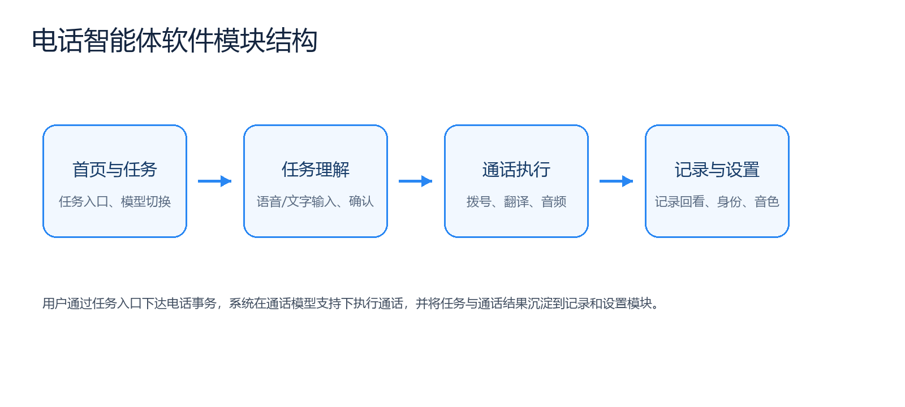

# Phone Agent 项目介绍

[English](PROJECT_INTRODUCTION.en.md) | 简体中文

## 把一句需求变成一项电话结果

Phone Agent 是面向真实电话事务的 Android 智能终端。用户不需要先学习复杂的电话流程，只需用语音或文字描述需求，系统便可以协助整理关键信息、确认任务、执行受支持的电话流程，并把状态、转写和结果带回终端。

它当前提供订餐厅、会议邀请、实时翻译和通用电话任务等入口，并面向未来的 **Call Skill（通话技能）** 生态演进：让开发者能够为预约、售后、物流、出行等场景开发可复用的电话工作流。

本仓库开放 Android 终端源码。模型推理、短信认证、地图检索、任务编排、电话线路和数据服务运行在托管后台中，后台源码不在本仓库内。



## 一次完整体验

### 1. 登录并准备终端

用户通过手机号和短信验证码登录或注册。首次使用时，终端会根据实际功能检查网络、麦克风和扬声器/耳机环境，并在需要时申请联系人、电话、定位或相机权限。


### 2. 选择场景或直接说出需求

首页展示当前开放的电话场景和通话模型。用户可以选择订餐厅、会议邀请或实时翻译等入口，也可以从中央入口描述通用电话任务。


### 3. 用语音或文字补齐任务

用户可以按住语音按钮说出需求，也可以切换到文字输入。系统通过对话收集任务所需的时间、地点、联系人、号码、人数或偏好，并在执行前请求确认。


### 4. 确认并进入通话

拨号页用于确认被叫号码、通话模型和实时翻译设置。受支持的任务由终端和托管后台协同执行；具体模型、线路、区域及并发能力以托管服务为准。


### 5. 回看过程和结果

完成后的任务进入记录列表。用户可以查看通话时间、号码、状态、转写、任务结果，以及在获得权限时访问录音。


### 6. 调整身份、模型与声音

设置页集中管理身份资料、AI 通话模型和音色、可信来电、版本更新及日志上报。获得独立商业服务授权后，还可以接入声音克隆身份认证能力。


## 核心能力

- **自然语言任务入口**：通过语音或文字描述电话事务。
- **关键信息补齐与确认**：整理时间、地点、联系人、人数等任务字段，并在执行前确认。
- **真实电话流程**：由终端和托管后台协同模型、业务工具及电话线路。
- **实时翻译展示**：在支持的模型和区域中展示双向转写及译文。
- **联系人与号码辅助**：在用户授权后读取本地联系人并辅助选择号码。
- **结果沉淀**：保存任务状态、通话记录、转写、结果和有权限访问的录音。
- **模型与音色偏好**：显示后台开放的模型，管理终端侧声音和翻译偏好。
- **可信通信与可观测性**：集成可信通信组件，并支持用户主动导出或上传客户端日志。

## 从内置场景走向 Call Skill

今天的 Phone Agent 提供内置电话场景；未来希望把这些场景背后的共同结构开放给开发者。一个 Call Skill 将描述任务匹配条件、输入字段、对话策略、可用工具、完成条件、结果格式以及权限和合规要求。

```text
用户意图
  → 匹配 Call Skill
  → 收集并确认必要信息
  → 执行受约束的电话策略和工具
  → 返回结构化结果
```

Call Skill SDK 当前尚未发布。项目会先公开概念模型与提案流程，再逐步推进规范、SDK、调试测试和社区分发。详见 [Call Skill 愿景](CALL_SKILLS.zh-CN.md)和[路线图](ROADMAP.zh-CN.md)。

## 技术概览

- Kotlin、Jetpack Compose、AndroidX
- MVVM、单向数据流、Kotlin Coroutines 与 Flow
- Retrofit / OkHttp HTTP 与 SSE 通信
- WebSocket 音频和实时事件通信
- SIP、WebRTC、音频采集与播放
- 本地缓存、联系人、通话记录和 OTA 集成
- 公司自有且已加固的 CHAKEN 可信通信 SDK

终端、后台、SIP/PSTN、远端模型和开源范围的完整关系见[全栈架构与开源边界](ARCHITECTURE.html)。

## 开源与服务边界

本仓库的目标是让开发者理解、构建和扩展 Android 终端。它不包含：

- Java/Spring 服务端或管理后台源码；
- 模型、短信、SIP、地图、对象存储等生产凭据；
- 生产数据库、运维脚本、部署拓扑和内部研发记录；
- 未获得公开再分发许可的商业 AAR/JAR；
- 尚在规划中的 Call Skill SDK 和分发平台。

客户端默认连接 Phone Agent 托管服务。开发者可以修改界面、终端策略，或自行实现兼容的服务端协议，但本仓库不包含完整服务端实现。详见[后台服务边界](BACKEND_SERVICE.md)。

## 负责任地使用

电话外呼、录音、联系人、身份资料、位置、翻译和声音克隆可能受到法律、运营商及供应商规则约束。使用者应取得必要授权，向通话参与者进行适当告知，避免无关敏感数据，并对自己的号码、内容、资费和合规性负责。Phone Agent 和未来 Call Skill 不应被用于骚扰、垃圾外呼、欺骗或未经授权的身份模拟。
